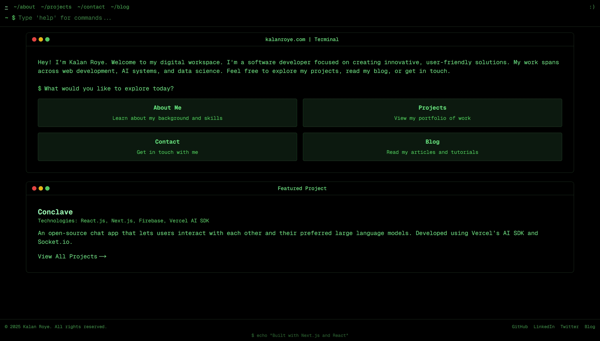

# Portfolio & Blog
### My Personal Digital Space

A modern portfolio and blog site built with Next.js 15 and React 19. Showcasing my projects, thoughts, and professional journey in a clean, responsive interface.

## 📸 Screenshots

### Portfolio Home

## ✨ Features

📱 Responsive Design

- Mobile-first approach for all device compatibility
- Fluid layouts that adapt to any screen size
- Optimized images and assets for fast loading
- Accessible navigation and content structure

📝 Blog Platform

- Markdown-based content management
- Categorized articles and posts
- Code syntax highlighting
- Reading time estimates

💼 Project Showcase

- Detailed project descriptions
- Technology stack highlights
- Live demo and repository links
- Visual galleries of project screenshots

🔍 SEO Optimization

- Metadata management for better search visibility
- Structured data for rich search results
- Fast page loading with optimized assets
- Semantic HTML structure

## 🛠️ Tech Stack

- **Frontend**: Next.js 15, React 19, Tailwind CSS
- **Backend**: Next.js API Routes
- **Data Storage**: Upstash Redis
- **Content**: Markdown with gray-matter and marked
- **Deployment**: Vercel with Vercel Blob Storage

## 📄 License

This project is licensed under the [Creative Commons Attribution-NonCommercial 4.0 International License](https://creativecommons.org/licenses/by-nc/4.0/). This means you can view and share the code, but cannot use it for commercial purposes without permission.

## Acknowledgments

- [Next.js](https://nextjs.org) for the application framework
- [Tailwind CSS](https://tailwindcss.com) for styling
- [Upstash](https://upstash.com) for Redis database
- [Vercel](https://vercel.com) for hosting and Blob storage
